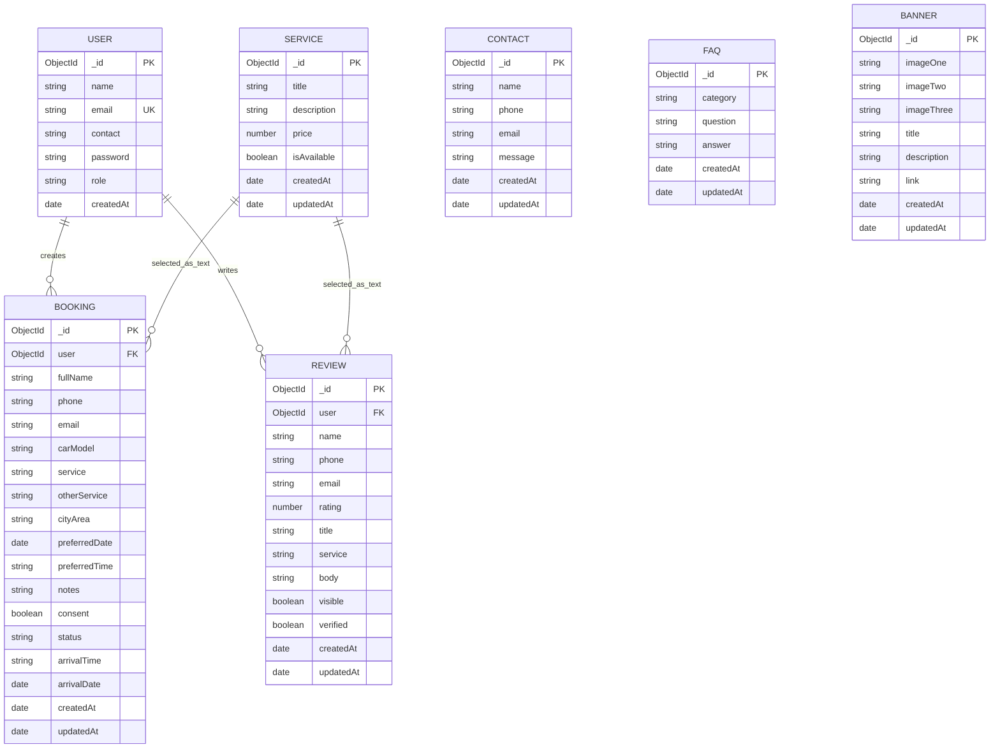

# AutoSphere ERD (Entity Relationship Diagram)

## 1. Drawn ERD (Text Version)
```text
+-------------------+            +-------------------+
|       USER        |1          M|      BOOKING      |
|-------------------|------------|-------------------|
| PK _id            |            | PK _id            |
| name              |            | FK user -> USER   |
| email (unique)    |            | fullName          |
| contact           |            | phone             |
| password          |            | carModel          |
| role              |            | service (text)    |
| createdAt         |            | status            |
+-------------------+            | preferredDate     |
                                 | preferredTime     |
                                 | createdAt         |
                                 +-------------------+

+-------------------+            +-------------------+
|       USER        |1          M|       REVIEW      |
|-------------------|------------|-------------------|
| PK _id            |            | PK _id            |
| name              |            | FK user -> USER   |
| ...               |            | rating            |
+-------------------+            | title             |
                                 | service (text)    |
                                 | body              |
                                 | visible           |
                                 | verified          |
                                 | createdAt         |
                                 +-------------------+

+-------------------+   conceptual   +-------------------+
|      SERVICE      |1------------M  | BOOKING / REVIEW  |
|-------------------|                | service name text |
| PK _id            |                +-------------------+
| title             |
| description       |
| price             |
| isAvailable       |
+-------------------+

+-------------------+   +-------------------+   +-------------------+
|      CONTACT      |   |        FAQ        |   |      BANNER       |
|-------------------|   |-------------------|   |-------------------|
| PK _id            |   | PK _id            |   | PK _id            |
| name              |   | category          |   | imageOne          |
| phone             |   | question          |   | imageTwo          |
| email             |   | answer            |   | imageThree        |
| message           |   | createdAt         |   | title             |
| createdAt         |   +-------------------+   | description       |
+-------------------+                           | link              |
                                                | createdAt         |
                                                +-------------------+
```

## 2. Mermaid ERD (For Report/Docs)


## 3. Cardinality Notes
- `USER (1) -> (M) BOOKING`
- `USER (1) -> (M) REVIEW`
- `SERVICE` to `BOOKING/REVIEW` is conceptual (service name stored as string, not ObjectId FK).
- `CONTACT`, `FAQ`, and `BANNER` are standalone admin-managed entities.
